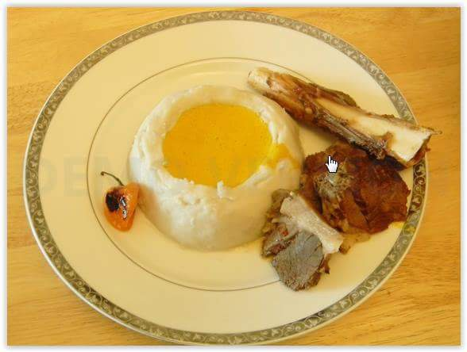

# image_retrieval_binary_hash_code
Image Retrieval based on Binary Hash Code and CNN

Image Retrieval realizing cvprw15 paper，including Face image and other image

Created by zhleternity

## Introduction:

This repo is based on the cvprw15 paper about image retrieval(proposed by [**Kevin Lin - cvprw15**](https://github.com/kevinlin311tw/caffe-cvprw15)) for CBIR tasks.it is about the using of **binary hash code** with **image retrieval**.

## Goals:

  * The extraction of binary hash codes & deep features
  * Fast indexing of both binary hash codes & deepfeatures
  * Fast computing of similarity (distances) based on features & binary codes extrated
  * Easy request for similar images (in database)
  * Sorted visualization of results

## Datasets && Downloads:

In the repo, you can test on Webface dataset and foods25 dataset directly. If you wanna to download the above mentioned datasets and model,please have a look on **Running this demo** section to downlowd what you wanted.
But also,you can train your own dataset and other datasets from scratch,and then do the testing.Please have a look on **Training From Scratch** section to do the training work.

## Hardwares/Softwares:
    OS: Ubuntu 16.04 64 bit
    GPU: Nvidia RTX 2070
    Cuda 9.2
    CuDNN 7.5.0
    Python 2.7.12
    OpenCV 3.2.0
    
## Prerequisites:

  1. Caffe(https://github.com/BVLC/caffe)
  2. Python's packages (requirements.txt),install command is: ```$ pip install -r requirements.txt```
  3. OpenCV((http://www.pyimagesearch.com/2016/10/24/ubuntu-16-04-how-to-install-opencv/)

## Running this demo:

1. Download this repository:

    ```
    $ git clone --recursive https://github.com/zhleternity/image-retrieval-lsh.git,
    $ cd image-retrieval-lsh
    ```
    
    ```sh
    ├── corefuncs #main functions about fetaure extraction,indexing,distances,and results showing
    ├── data  #dataset and extracted feature file(.hdf5)
    ├── models #model and prototxt
    ├── results #output results
    |── indexing.py #extract features,and build the index
    ├── retrieve.py #do the image retrieval
    ├── init_path.py #init caffe path and other config
    ├── README.md
    └── requirements.txt
    ```
  
2. Download datasets and model:

For the foods25 dataset,it has already exists in this repo,so you need not downlowd.
For the Webface dataset, you need download by yourself.
Get the data and models required:
- Download the data and uncompress in 'image-retrieval-lsh/data'
  * foods25: [Google Drive](https://drive.google.com/open?id=0B_Rjj_NgCayPRExDYkNKTWF1bjQ)
  * Webface: http://www.cbsr.ia.ac.cn/english/CASIA-WebFace-Database.html
  
- Download the models and uncompress in 'image-retrieval-lsh/models'
  * foods25: [Google Drive](https://drive.google.com/open?id=0B_Rjj_NgCayPcC1kNXlRWmRWY2M)
  * Webface: https://pan.baidu.com/s/1ecbDJgp48IvRBrU4RHTFKA Extract Code：p5l3 

  
3. Extract features && Build the index:

```
$ python indexing.py -u <use GPU or not,0 or 1> -d <path to your dataset> -o <your output data-db name>
```

4. Searching:

```
$ python retrieve.py -u <use GPU or not,0 or 1> -f <your output data-db name> -d <path to your dataset> -q <your query image>
```
    
## Experiments:

1. Feature extraction & indexing of a sample dataset (foods25) with the following commands:
    
    ```
    $ python indexing -u 1 -d data/foods25/imgs -o data/foods25/foods25.hdf5
    ```
    In my repo, the `foods25.hdf5` have already exists,so you can skip thie step.
  
  The output of this command is stored as **'data/foods25/foods25.hdf5'**.
  
2. Search for similar images:

    ```
    $ python retrieve.py -u 1 -f data/foods25/foods25.hdf5 -d data/foods25/imgs -q data/foods25/imgs/taro/28581814.jpg
    ```
  
  The output of this command is stored in **'results/'**
  
## Matters need attention

When you run the above **Experiments** section,the model and prototxt path in **`indexing.py`** && **`retrieve.py`** should be corresponding to your dataset.

Please see th following screenshot:


## Show results

Query:



Results:


## Training From Scratch

Now,we begin to train the demo from scratch.And then you can test the retrieval on your trained model.

- Split your data

```
$ cd data/facescrub

$ mkdir train && mkdir val

$ python split_dataset.py
```
Before this op,you will see your images is in **train** && **val**

- Convert txt

```
$ touch train.txt && touch val.txt

$ python generate_txt.py
```
This operation will yeild two non-empty txt profile:**train.txt** && **val.txt**

- Convert data into LMDB or LevelDB

```
$ sh create_imagenet.sh
```
This operation will yeild two leveldb profile:**facescrub_train_leveldb** && **facescrub_val_leveldb**

Attention that:you may need do some change on the path,please change it to correspond to your directory path and dataset.

- Train

```
$ cd ../../examples/facescrub
```
Please replace the data source path to your leveldb path in train_face_48.prototxt and test_face_48.prototxt .Also change the path in solver_face_48.prototxt.
```
$ /xxx/xxx/caffe/build/tools/caffe train -solver solver_face_48.prototxt -gpu 1
```
All this steps are easy for human who are familiar to Caffe，hence issues above mentioned are brief.

## Contact
Please pull issues to me directly,i will return you on time.

